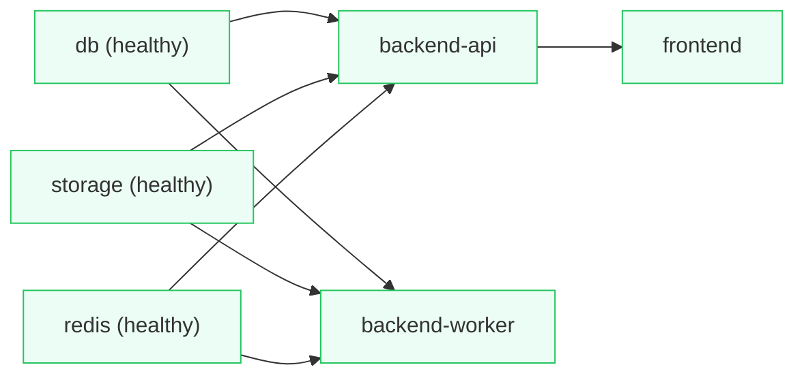
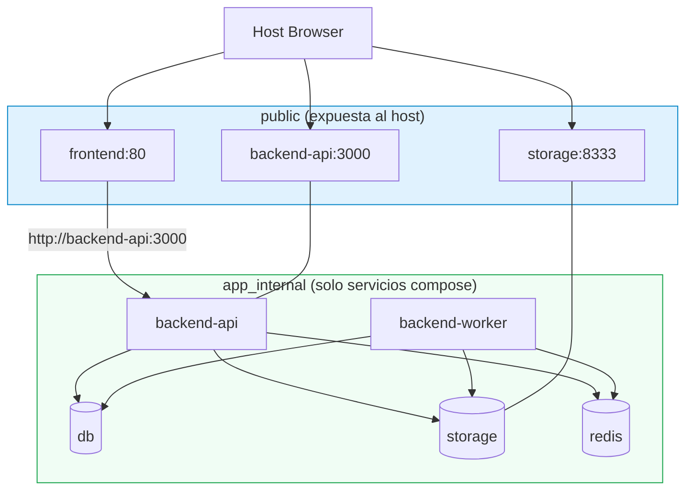

# Arquitectura - Docker Compose (Riskio)

## 1. Resumen del estado actual

El `docker-compose.yml` actual reemplazó MinIO + contenedores init one-shot por **SeaweedFS (S3-compatible)**, añadió **Redis**, usa **healthchecks** con `depends_on.condition: service_healthy`, separa `backend-api` y `backend-worker`, y sirve el frontend con Nginx. Esta decisión resuelve el cuelgue con podman-compose 1.6.0 (no depende de contenedores `Exited`).

Cambios recientes relacionados con infra: eliminación de `minio`, `minio-init-bucket`, `minio-init-public`; nuevo servicio `storage` (SeaweedFS); backend hace bootstrap idempotente del bucket (HeadBucket/CreateBucket/PutBucketPolicy) vía `OnApplicationBootstrap` en `S3StorageService`.

## 2. Servicios actuales

| Servicio | Imagen | Puertos (host) | Dependencias (healthy) | Volumen | Rol |
|---|---|---|---|---|---|
| `db` | `postgis/postgis:16-3.4` | `127.0.0.1:${POSTGRES_PORT:-5432}:5432` | — | `pgdata` | PostgreSQL + PostGIS |
| `storage` | `docker.io/chrislusf/seaweedfs` | `${STORAGE_PORT:-8333}:8333` | — | `storage_data` | S3-compatible (SeaweedFS) `server -s3 -s3.port=8333 -volume.max=100` |
| `redis` | `docker.io/library/redis:7-alpine` | `${REDIS_PORT:-6379}:6379` | — | `redis_data` | Cache/broker (Redis) |
| `backend-api` | build `./backend` (Dockerfile) | `${BACKEND_API_PORT:-3000}:3000` | `db`, `storage`, `redis` | — | NestJS API HTTP |
| `backend-worker` | build `./backend` (cmd `npm run start:worker`) | — | `db`, `storage`, `redis` | — | Worker en background |
| `frontend` | build `./frontend` (NGINX, multi-stage) | `${WEB_PORT:-8080}:80` | `backend-api` (healthy) | — | SPA servida por Nginx |

Variables relevantes (API/worker):
- `STORAGE_DRIVER: s3`, `STORAGE_ENDPOINT: http://storage:8333` (comunicación interna entre contenedores)
- `STORAGE_PUBLIC_URL: http://localhost:${STORAGE_PORT:-8333}/riskio-avatars` (acceso público desde navegador)
- `DATABASE_URL`, `REDIS_URL: redis://redis:6379`, `CACHE_DRIVER: redis`, `BROKER_DRIVER: memory`, `IS_WORKER: "true"` (worker)

Healthchecks:
- `db`: `pg_isready -U ${POSTGRES_USER} -d ${POSTGRES_DB}` (10s/5s/5)
- `storage`: `wget -q -O - http://127.0.0.1:8333/` (10s/5s/5, `start_period: 10s`)
- `redis`: `redis-cli ping` (10s/5s/5, `start_period: 5s`)
- `backend-api`: `fetch('http://localhost:3000/health')` (30s/5s/3, `start_period: 20s`)

## 3. Diagrama - Arquitectura actual

```mermaid
graph TB
  subgraph Host["Host (localhost)"]
    B["Navegador (Browser)"]
  end

  B -->|"http://localhost:8080"| FE["frontend:80 (Nginx)"]
  B -->|"http://localhost:3000"| API_P["backend-api:3000 (published)"]
  B -->|"http://localhost:8333/riskio-avatars/*"| S3_P["storage:8333 (S3 API published)"]

  subgraph App["Red Docker (compose default)"]
    FE
    API["backend-api"]
    WK["backend-worker"]
    DB[("db:5432 (Postgres+PostGIS)")]
    S3[("storage:8333 (SeaweedFS S3)")]
    R[("redis:6379")]
  end

  FE -->|"VITE_API_URL / proxy a API"| API_P
  FE -->|"Llamadas API"| API
  API -->|"TypeORM"| DB
  API -->|"AWS SDK S3 (path-style)\nendpoint: http://storage:8333"| S3
  API -->|"ioredis / Cache\nredis://redis:6379"| R

  WK -->|"TypeORM"| DB
  WK -->|"S3 SDK"| S3
  WK -->|"Redis"| R

  API_P --- API
  S3_P --- S3

  classDef svc fill:#f5f7ff,stroke:#7c8bff,stroke-width:1px
  classDef data fill:#fff4e6,stroke:#ffb020,stroke-width:1px
  classDef host fill:#f1f5f9,stroke:#94a3b8,stroke-width:1px
  class FE,API,WK,svc
  class DB,S3,R,data
  class B,Host host
```

## 4. Orden de arranque (dependencias)



- `db/storage/redis`: healthchecks independientes.
- `backend-api/backend-worker`: esperan a que los 3 estén `service_healthy` (reduce race conditions).
- `frontend`: espera a que `backend-api` esté `healthy` (evita servir SPA antes de que API responda `/health`).

## 5. Fortalezas

- **Sin init one-shot**: elimina `minio-init-*`. Compatible con podman-compose 1.6.0 (`depends_on` + `condition: service_healthy`). Decisión correcta tras diagnóstico.
- **Health-based orchestration**: usa condiciones por health, no por `service_started`. Reduce flakiness en arranque.
- **SeaweedFS S3-compatible**: ligero, en contenedor, mismo `@aws-sdk/client-s3` (fácil migrar a AWS/LocalStack). Backend hace bootstrap idempotente (cubre hueco de init containers).
- **Separación API/Worker**: clara, permite escalar por responsabilidades.
- **Redis presente**: coherente con `CACHE_DRIVER=redis`. Útil para cache compartido.
- **Endpoints separados (interno/público)**: `STORAGE_ENDPOINT=http://storage:8333` (DNS interno Docker) vs `STORAGE_PUBLIC_URL=http://localhost:8333/...` (navegador). Correcto.
- **Puertos acotados**: `db` bind a `127.0.0.1` (solo host). Variables parametrizables por `.env`.
- **Healthchecks con `start_period`**: da margen a arranque de servicios pesados (SeaweedFS/Postgres/API).
- **Volúmenes nombrados + `restart: unless-stopped`**: gestión de datos y resiliencia básica.

## 6. Debilidades / Riesgos

| Riesgo | Descripción | Impacto | Mitigación sugerida |
|---|---|---|---|
| **Credenciales hardcodeadas** | `STORAGE_ACCESS_KEY:any`, `STORAGE_SECRET_KEY:any` repetidos en API y worker (inline). | Bajo (dev/local) | Extraer a `.env` compartido o usar YAML anchors/x-common para evitar duplicidad. No exponer en entornos no-local. |
| **STORAGE_PUBLIC_URL asume localhost** | Funciona en dev host. En rootless/podman o acceso remoto puede variar (quirk detectado: curl a localhost desde host puede dar reset). | Medio | Parametrizar por entorno (dev/prod). En prod usar proxy/CDN o mismo origen (reverse proxy). Documentar este comportamiento. |
| **Duplicidad de `environment`** | Bloques STORAGE_* idénticos entre `backend-api` y `backend-worker`. | Bajo | Usar `x-common-storage: &common-storage` (YAML anchors) + extender, o heredar vía `.env`. Reduce drift. |
| **BROKER_DRIVER=memory** | Colas/jobs en memoria. Si API/worker reinician o escalan réplicas, jobs en memoria se pierden. | Medio (dependiendo de jobs) | Evaluar `BROKER_DRIVER=redis` si los jobs de ingest/background no pueden perderse (BullMQ/Agenda). Redis ya existe. |
| **Red implícita única** | Usa red por defecto de compose (todos en misma red). Sin aislamiento interno vs público. | Bajo | Crear red dedicada (`app_internal` sin exposición innecesaria + `public` opcional). Útil para hardening y claridad. |
| **Exposición de puertos** | `redis:6379`, `storage:8333` expuestos al host (útiles para debug con `redis-cli`/boto3). | Bajo (dev local) | En entornos compartidos/CI limitar a `127.0.0.1:${PORT}:PORT` o quitar exposición si solo servicios Docker los consumen. |
| `runtime: runc` | Explícito en todos los servicios. | Muy bajo | Prescindible (podman usa su runtime por defecto). No perjudica, puede simplificarse. |
| **Healthcheck de storage** | Usa `wget` a raíz `http://127.0.0.1:8333/`. Depende de que `wget` exista en imagen. | Muy bajo | Suele estar en imagen base (busybox). Alternativa: `curl -fsS http://127.0.0.1:8333/` si disponible. Funciona tal como está. |

## 7. Propuesta de mejora (compose)

### 7.1 Red dedicada (aislamiento)

Separar red interna (comunicación entre API/worker/db/storage/redis) de red pública (frontend/API/storage expuestos al host).



**Ventajas**: menor superficie de exposición, tráfico interno más claro, prepara para despliegues con reverse proxy.

### 7.2 YAML Anchors (evitar duplicidad ENV)

Extraer variables S3 compartidas para API/worker:

```yaml
x-common-storage: &common-storage
  STORAGE_DRIVER: s3
  STORAGE_ENDPOINT: http://storage:8333
  STORAGE_REGION: us-east-1
  STORAGE_BUCKET: riskio-avatars
  STORAGE_ACCESS_KEY: ${STORAGE_ACCESS_KEY:-any}
  STORAGE_SECRET_KEY: ${STORAGE_SECRET_KEY:-any}
  STORAGE_PUBLIC_URL: ${STORAGE_PUBLIC_URL:-http://localhost:${STORAGE_PORT:-8333}/riskio-avatars}
```

Aplicar `<<: *common-storage` en `backend-api` y `backend-worker`. Esto reduce repetición y riesgo de drift.

### 7.3 Broker con Redis (si aplica)

Si los jobs en background deben persistir ante reinicios o hay múltiples workers, evaluar:

```yaml
environment:
  BROKER_DRIVER: redis
  REDIS_URL: redis://redis:6379
```

Actualmente `BROKER_DRIVER: memory`. Solo cambiar si hay requisitos de durabilidad de jobs (no crítico para dev).

### 7.4 Endpoints/public URL por entorno

Mantener `STORAGE_PUBLIC_URL` parametrizable vía `.env` (no hardcodeado). Útil para rootless, Docker Desktop, redes remotas o cuando se usa reverse proxy único (mismo origen). El bootstrap del bucket en backend es correcto (usa endpoint interno para S3 SDK).

### 7.5 Recursos y límites (dev opcional)

Añadir `mem_limit`, `cpus` (Compose v2) para evitar consumo excesivo (Postgres + SeaweedFS). No bloqueante para desarrollo local.

## 8. Veredicto

La arquitectura del compose es **adecuada y sólida para desarrollo local**. La migración de MinIO→SeaweedFS sin init one-shot + healthchecks + separación API/worker es correcta.

Las mejoras propuestas son **evolutivas (mantenibilidad, aislamiento, preparación para prod)**, no correcciones críticas. El mayor detalle práctico a tener en cuenta es la diferencia `endpoint` interno vs `STORAGE_PUBLIC_URL` público (navegador) y su comportamiento en rootless/podman.

