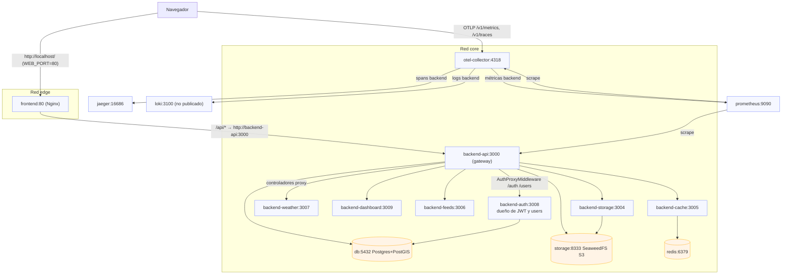
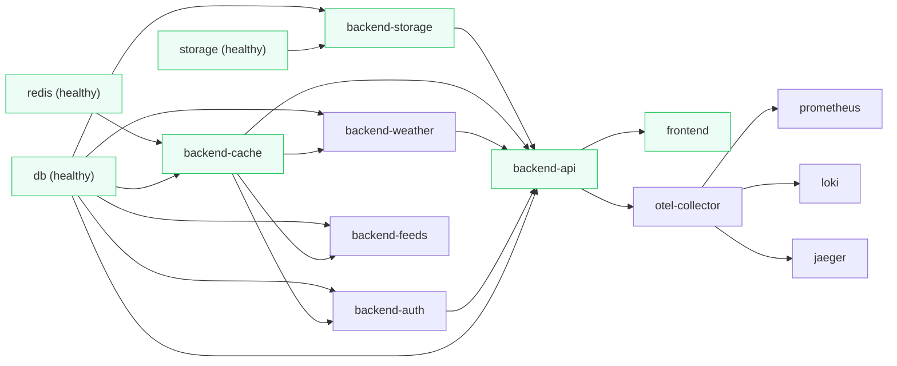
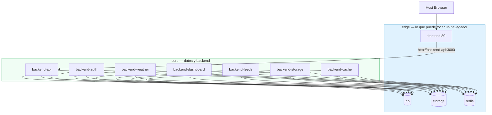

# Arquitectura - Docker Compose (Riskio)

> Se ejecuta con **podman-compose**, no con `docker compose`. El archivo sigue
> siendo `docker-compose.yml` y la sintaxis es la misma, pero los comandos y
> algunas rutas cambian. Ver [ARCHITECTURE-PODMAN.md](ARCHITECTURE-PODMAN.md)
> para la operación diaria.

## 1. Resumen del estado actual

El `docker-compose.yml` actual reemplazó MinIO + contenedores init one-shot por **SeaweedFS (S3-compatible)**, añadió **Redis**, usa **healthchecks** con `depends_on.condition: service_healthy`, separó el backend en siete procesos y sirve el frontend con Nginx. Esta decisión resuelve el cuelgue con podman-compose 1.6.0 (no depende de contenedores `Exited`).

Cambios recientes relacionados con infra: eliminación de `minio`, `minio-init-bucket`, `minio-init-public`; nuevo servicio `storage` (SeaweedFS); backend hace bootstrap idempotente del bucket (HeadBucket/CreateBucket/PutBucketPolicy) vía `OnApplicationBootstrap` en `S3StorageService`.

## 2. Servicios actuales

Diecisiete servicios. El inventario de antes listaba seis y daba por hecho un
`backend-worker` que no existe; la ingesta vive en `backend-feeds`.

### 2.1 Datos

| Servicio | Imagen | Puertos (host) | Volumen | Rol |
|---|---|---|---|---|
| `db` | `postgis/postgis:16-3.4` | `127.0.0.1:5432` | `pgdata` | PostgreSQL + PostGIS |
| `redis` | `docker.io/library/redis:7-alpine` | `127.0.0.1:6379` | `redis_data` | Cache/broker |
| `storage` | `docker.io/chrislusf/seaweedfs` | `8333:8333` | `storage_data` | S3-compatible, `server -s3 -s3.port=8333 -volume.max=100` |

`storage` es el único de datos publicado **en todas las interfaces**, a propósito:
el navegador descarga los avatares de ahí sin credenciales. El bucket queda
abierto a quien conozca la URL.

### 2.2 Backend

| Servicio | Puerto host | `command` | Rol |
|---|---|---|---|
| `backend-api` | `3000` | (CMD) `start:prod` | gateway; `/storms`, `/advisories`, `/dashboard`, `/admin/ingest` |
| `backend-auth` | `127.0.0.1:3008` | `start:auth` | dueño de `JWT_SECRET` y de la tabla `users` |
| `backend-weather` | `127.0.0.1:3007` | `start:weather` | proxy a NOAA NHC |
| `backend-dashboard` | `127.0.0.1:3009` | `start:dashboard` | agregados del dashboard |
| `backend-feeds` | `127.0.0.1:3006` | `start:feeds` | ingesta |
| `backend-storage` | `127.0.0.1:3004` | `start:storage` | objects en SeaweedFS |
| `backend-cache` | `127.0.0.1:3005` | `start:cache` | Redis por HTTP |

Los seis internos comparten imagen con `backend-api`; lo que los distingue es el
`command`. Un cambio en código compartido hay que desplegarlo en **todos** los
procesos que lo usen, o se prueban versiones distintas a la vez.

### 2.3 Observabilidad

| Servicio | Imagen | Puertos (host) | Volumen |
|---|---|---|---|
| `otel-collector` | `otel/opentelemetry-collector-contrib:0.139.0` | `127.0.0.1:4318` | — |
| `prometheus` | `prom/prometheus:v3.6.0` | `127.0.0.1:9090` | `prometheus_data` |
| `pushgateway` | `docker.io/prom/pushgateway:v1.11.3` | `127.0.0.1:9091` | `pushgateway_data` |
| `jaeger` | `docker.io/jaegertracing/jaeger:2.21.0` | `127.0.0.1:16686` | `jaeger_data` |
| `loki` | `grafana/loki:3.5.5` | **no publicado** | `loki_data` |
| `grafana` | `grafana/grafana:12.3.1` | `127.0.0.1:3001` | `grafana_data` |

Loki no publica puerto a propósito y solo está en la red `core`. Para consultarlo
hay que entrar por un contenedor que comparta red; ver
[ARCHITECTURE-PODMAN.md](ARCHITECTURE-PODMAN.md).

### 2.4 Frontend

| Servicio | Puertos (host) | Rol |
|---|---|---|
| `frontend` | `${WEB_PORT}:80` | SPA servida por Nginx, y el proxy `/api` hacia `backend-api` |

El compose declara `${WEB_PORT:-8080}`, pero el `.env` fija `WEB_PORT=80`, así que
**en este entorno la app está en `http://localhost/` y no en `:8080`**. El default
del compose no es el valor real; no lo cites al escribir documentación o pruebas.

### 2.5 Variables relevantes

- `STORAGE_DRIVER: s3`, `STORAGE_ENDPOINT: http://storage:8333` (comunicación interna)
- `STORAGE_PUBLIC_URL: http://localhost:8333/riskio-avatars` (acceso del navegador)
- `DATABASE_URL`, `REDIS_URL: redis://redis:6379`, `CACHE_DRIVER: redis`
- `VITE_API_URL=/api`: el navegador habla same-origin y Nginx hace de proxy. Es lo
  que quita los preflights CORS; ver `ARCHITECTURE-FRONTEND.md` §10.

### 2.6 Healthchecks

- `db`: `pg_isready -U ${POSTGRES_USER} -d ${POSTGRES_DB}` (10s/5s/5)
- `storage`: `wget -q -O - http://127.0.0.1:8333/` (10s/5s/5, `start_period: 10s`)
- `redis`: `redis-cli ping` (10s/5s/5, `start_period: 5s`)
- `backend-api`: `fetch('http://localhost:3000/health')` (30s/5s/3, `start_period: 20s`)

Ojo con el estado `Created`: es un contenedor **sin arrancar**, no uno unhealthy.
Aparece si un comando anterior se interrumpió, y mientras siga así su puerto da
`000` en vez de un error que explique lo que pasa.

## 3. Diagrama - Arquitectura actual



`storage:8333` se publica sin restringir a loopback porque el navegador descarga
los avatares directamente de ahí. Ese es también su punto flaco: el bucket es
público para quien conozca la URL.

## 4. Orden de arranque (dependencias)



- `db/storage/redis`: healthchecks independientes, no dependen de nadie.
- `backend-storage` espera a `storage`; `backend-cache` espera a `redis` y `db`.
- `backend-auth`, `backend-weather` y `backend-feeds` esperan a `db` y `backend-cache`; `backend-dashboard` espera a `backend-cache` y `backend-weather`.
- `backend-api` espera a los cinco: `db`, `backend-storage`, `redis`, `backend-weather` y `backend-auth`. Es el único con una cadena de arranque real.
- `frontend` espera a que `backend-api` esté `healthy` (evita servir la SPA antes de que la API responda `/health`).
- Todo lo de observabilidad arranca sin `depends_on`; el Collector descarta lo que llega antes de que Prometheus esté listo.

## 5. Fortalezas

- **Sin init one-shot**: elimina `minio-init-*`. Compatible con podman-compose 1.6.0 (`depends_on` + `condition: service_healthy`). Decisión correcta tras diagnóstico.
- **Health-based orchestration**: usa condiciones por health, no por `service_started`. Reduce flakiness en arranque.
- **SeaweedFS S3-compatible**: ligero, en contenedor, mismo `@aws-sdk/client-s3` (fácil migrar a AWS/LocalStack). Backend hace bootstrap idempotente (cubre hueco de init containers).
- **Separación API/Worker**: clara, permite escalar por responsabilidades.
- **Redis presente**: coherente con `CACHE_DRIVER=redis`. Útil para cache compartido.
- **Endpoints separados (interno/público)**: `STORAGE_ENDPOINT=http://storage:8333` (DNS interno Docker) vs `STORAGE_PUBLIC_URL=http://localhost:8333/...` (navegador). Correcto.
- **Puertos acotados**: `db` bind a `127.0.0.1` (solo host). Variables parametrizables por `.env`.
- **Healthchecks con `start_period`**: da margen a arranque de servicios pesados (SeaweedFS/Postgres/API).
- **Volúmenes nombrados + `restart: unless-stopped`**: gestión de datos y resiliencia básica.

## 6. Debilidades / Riesgos

| Riesgo | Descripción | Impacto | Mitigación sugerida |
|---|---|---|---|
| **Credenciales hardcodeadas** | `STORAGE_ACCESS_KEY:any`, `STORAGE_SECRET_KEY:any` repetidos inline en los siete procesos backend. | Bajo (dev/local) | Extraer a `.env` compartido o usar YAML anchors. No exponer en entornos no-local. |
| **STORAGE_PUBLIC_URL asume localhost** | Funciona en dev host. En rootless/podman o acceso remoto puede variar. | Medio | Parametrizar por entorno. En prod, proxy/CDN o mismo origen. |
| **Duplicidad de `environment`** | Bloques STORAGE_* idénticos entre los siete procesos backend. | Bajo | `x-common-storage: &common-storage` + extender, o heredar vía `.env`. |
| **Bucket de avatares público** | `storage:8333` se publica en todas las interfaces porque el navegador descarga los avatares sin credenciales. Cualquiera con la URL lee el archivo. | **Alto en prod** | Dominio propio delante del bucket, o servir los avatares a través de la API con auth. |
| **Exposición de puertos** | `redis:6379` y `storage:8333` expuestos; los seis microservicios ya están en `127.0.0.1`. | Bajo (dev local) | `redis` puede pasar a `127.0.0.1` sin más; `storage` requiere decisión de diseño (ver fila anterior). |
| **`WEB_PORT` no es 8080** | El compose declara `${WEB_PORT:-8080}` pero el `.env` fija 80. Documentar o probar contra 8080 da connection refused. | Medio (confusión) | Fijar el default a 80 en el compose, o documentar que manda el `.env`. |
| `runtime: runc` | Explícito en todos los servicios. | Muy bajo | Prescindible. No perjudica, puede simplificarse. |
| **Healthcheck de storage** | Usa `wget` contra `http://127.0.0.1:8333/`. | Muy bajo | Funciona tal como está. |

Redes: la separación `core`/`edge` **ya está implementada** (ver §3), así que
queda fuera de esta lista.

## 7. Propuesta de mejora (compose)

### 7.1 Red dedicada (aislamiento) — **hecho**

Las redes `core` y `edge` existen en el compose. `core` lleva el plano de datos y
los procesos backend; `edge` lleva lo que puede tocar un navegador. La propuesta
original era `public` + `app_internal`; se resolvió al revés, con los nombres
`core` y `edge`, porque lo que importa es la frontera del navegador y no si algo
está "expuesto al host".



`backend-api` está en las dos redes a propósito: es el único que recibe peticiones
del navegador y el único que habla con los demás procesos.

**Ventajas**: menor superficie de exposición, tráfico interno más claro, prepara para despliegues con reverse proxy.

### 7.2 YAML Anchors (evitar duplicidad ENV)

Extraer variables S3 compartidas para los siete procesos backend:

```yaml
x-common-storage: &common-storage
  STORAGE_DRIVER: s3
  STORAGE_ENDPOINT: http://storage:8333
  STORAGE_REGION: us-east-1
  STORAGE_BUCKET: riskio-avatars
  STORAGE_ACCESS_KEY: ${STORAGE_ACCESS_KEY:-any}
  STORAGE_SECRET_KEY: ${STORAGE_SECRET_KEY:-any}
  STORAGE_PUBLIC_URL: ${STORAGE_PUBLIC_URL:-http://localhost:${STORAGE_PORT:-8333}/riskio-avatars}
```

Aplicar `<<: *common-storage` en los siete procesos backend. Esto reduce repetición y riesgo de drift.

### 7.3 Cola de mensajes: eliminada

No hay broker. La capa entera (`domain/messaging`, con adapters de memory, SQS y Kafka) se
retiró porque su único uso era entregar la limpieza de avatares huérfanos, y esa entrega
nunca funcionó: la API publicaba y el worker consumía, cada uno con su cola en memoria, así
que el evento no cruzaba procesos. `UsersService` borra el avatar directamente contra
`STORAGE_SERVICE`. La ingesta de NHC nunca pasó por el broker: es un `@Cron`.

Si alguna vez hace falta asincronía real, el punto de entrada es Redis (ya está en el stack)
con BullMQ o Agenda, no un broker propio.

### 7.4 Endpoints/public URL por entorno

Mantener `STORAGE_PUBLIC_URL` parametrizable vía `.env` (no hardcodeado). Útil para rootless, Docker Desktop, redes remotas o cuando se usa reverse proxy único (mismo origen). El bootstrap del bucket en backend es correcto (usa endpoint interno para S3 SDK).

### 7.5 Recursos y límites (dev opcional)

Añadir `mem_limit`, `cpus` (Compose v2) para evitar consumo excesivo (Postgres + SeaweedFS). No bloqueante para desarrollo local.

## 8. Veredicto

La arquitectura del compose es **adecuada y sólida para desarrollo local**. La migración de MinIO→SeaweedFS sin init one-shot + healthchecks + separación en microservicios es correcta.

Las mejoras propuestas son **evolutivas (mantenibilidad, aislamiento, preparación para prod)**, no correcciones críticas. El mayor detalle práctico a tener en cuenta es la diferencia `endpoint` interno vs `STORAGE_PUBLIC_URL` público (navegador) y su comportamiento en rootless/podman.

