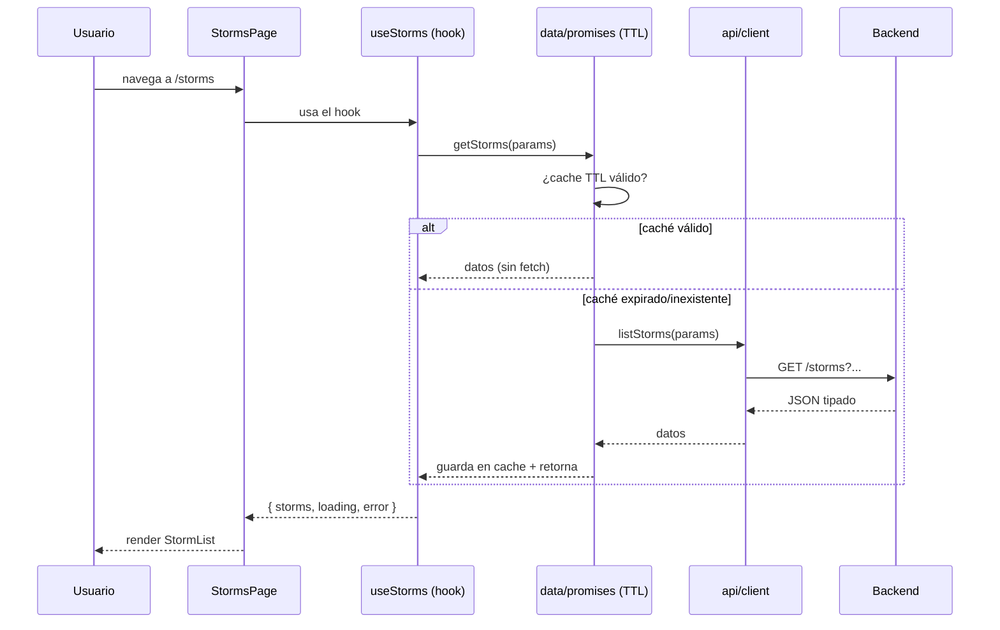
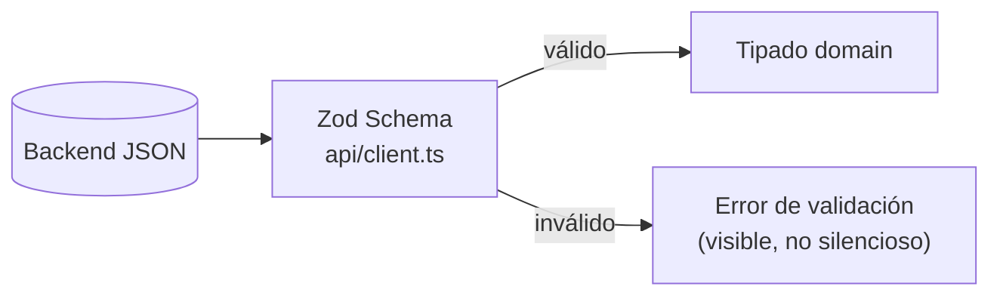

# Arquitectura Frontend - Riskio (React 19 + Programación Funcional)

## 1. Resumen del estado actual

El frontend (`frontend/`) es una SPA en **React 19 + Vite + TypeScript** con **React Router v6**, Tailwind CSS, y una organización **feature-based + domain-driven**. El refactor reciente movió `storms` a `features/weather/storms` (feature-first), movió los componentes compartidos a `components/` global, introdujo **TTL preload caches** en `data/promises.ts` y un **history API tipado** con helpers de dominio.

## 2. Estructura de carpetas

```text
frontend/src/
├── app/                 # Router (routes.tsx), providers, layout base
├── assets/              # estáticos
├── auth/                # SessionContext, hooks, guards, tipos
├── components/          # UI compartida (global) + components/layout/
│   ├── layout/          # app / protected / public
├── data/                # caches/preload con TTL, helpers (promises.ts), datos estáticos
├── domain/              # dominios tipados (weather/storms, auth, advisories, ...)
│   └── weather/storms/  # tipos, enums, mappers
├── features/            # feature slices
│   └── weather/storms/  # páginas, componentes, hooks de la feature
├── hooks/               # hooks genéricos
├── lib/                 # utils (cn/clsx, helpers puros)
├── pages/               # páginas protegidas/públicas
├── api/                 # cliente HTTP (client.ts), tipos API
├── utils/               # helpers
├── main.tsx             # entrypoint
├── index.css
└── vite-env.d.ts
```

## 3. Diagrama - Arquitectura React (alto nivel)

```mermaid
graph TB
  subgraph AppRoot["main.tsx (entrypoint)"]
    P["Providers<br/>RouterProvider + SessionProvider"]
  end
  P --> R["app/router/routes.tsx<br/>(rutas declarativas)"]

  subgraph Routes["Layouts (anidados)"]
    Pub["PublicLayout<br/>(login, registro)"]
    Prot["ProtectedLayout<br/>(sidebar, guards)"]
  end
  R --> Pub & Prot

  subgraph Features["Feature slices"]
    W["features/weather/storms<br/>(StormsPage, componentes, hooks)"]
  end
  Prot --> W
  Prot --> Pages["pages/protected/*<br/>(Storms, Dashboard, ...)"]

  subgraph Auth["auth/*"]
    SC["SessionContext"]
    Guard["ProtectedRoute / guards"]
  end
  Guard --> Prot
  SC --> Guard

  subgraph Data["Datos"]
    Promise["data/promises.ts<br/>TTL preload caches"]
    Client["api/client.ts<br/>(fetch tipado)"]
  end
  W --> Promise
  W --> Client
  Promise --> Client
  Client --> Backend["Backend API (NestJS)"]

  subgraph Shared["Compartido"]
    UI["components/*<br/>(Botones, Cards, Icons, etc.)"]
    Layouts["components/layout/*"]
    Hooks["hooks/*"]
    Lib["lib/*"]
  end
  W --> UI
  W --> Layouts
  W --> Hooks
  W --> Lib
  Pages --> UI & Layouts

  W --> DomainW["domain/weather/storms<br/>(tipos, enums, mappers)"]
  Client --> DomainW

  classDef style fill:#f5f7ff,stroke:#7c8bff
  classDef dataDef fill:#fff4e6,stroke:#ffb020
  classDef authDef fill:#fce7f3,stroke:#ec4899
  class W,Pages,UI,Layouts style
  class Promise,Client,Backend,DomainW dataDef
  class SC,Guard authDef
```

## 4. Diagrama - Feature `weather/storms` (componentes, hooks, props)

```mermaid
graph TD
  SP["StormsPage.tsx<br/>(container/página)"]

  SP --> L["StormsList / StormsLayout<br/>(layout/protected/storms/*)"]
  SP --> F["StormsFilters<br/>(basin, tab, sort, búsqueda)"]
  SP --> KPI["StormsKPI / StormsMap<br/>(resúmenes)"]

  L --> Card["StormCard.tsx<br/>(item: name, basin, isActive, lastAdvisory)"]
  L --> EL["EmptyState / Loading / Error<br/>(estados de UI)"]

  SP --> H1["useStorms / useStormsFilters<br/>(hooks de feature: estado + fetch)"]
  H1 --> DP["data/promises.ts<br/>(preloadStorms / getStorms - TTL cache)"]
  DP --> AC["api/client.ts<br/>(listStorms: typed fetch)"]
  AC --> BE["Backend API"]

  SP --> T["domain/weather/storms<br/>(StormSummary, StormDetail, enums)"]

  classDef style fill:#f5f7ff,stroke:#7c8bff
  classDef dataDef fill:#fff4e6,stroke:#ffb020
  classDef stateDef fill:#fef3c7,stroke:#f59e0b
  class SP,L,F,KPI,Card style
  class DP,AC,BE,T dataDef
  class EL,stateDef stateDef
```

**Flujo de datos (un componente representative, tipo contenedor):**



## 5. Patrones de Programación (y buenas prácticas detectadas)

| Patrón | Ejemplo en el código | Por qué es bueno |
|---|---|---|
| **Feature-based / vertical slices** | `features/weather/storms/` agrupa UI específica de la feature | Escala bien, evita carpetas por "tipo" (components/utils mega-carpeta) |
| **Separación domain/UI** | `domain/weather/storms` (tipos, mappers) vs `features/...` (componentes) | El dominio es agnóstico de React; testeable y reutilizable |
| **Path aliases** | imports `@/...` | Imports limpios, refactors más seguros |
| **TypeScript estricto** | tipos en `api/`, `domain/`, DTOs | Seguridad de tipos en la frontera API/UI |
| **Funcional > OOP** | componentes funcionales, sin clases, sin `this` | Alineado con React moderno y FP |
| **Inmutabilidad** | props y estado inmutables, spread, `map/filter` | predictability, sin side effects ocultos |
| **Routing declarativo** | `routes.tsx` con layouts anidados | Estructura de rutas explícita, lazy-loading por ruta |
| **Estado de auth centralizado** | `SessionContext` + guards | Fuente única de verdad para sesión/autenticación |
| **Data fetching desacoplado** | `api/client.ts` centraliza HTTP | Un solo lugar para interceptores, errores, CORS |
| **Preload / memoización con TTL** | `data/promises.ts` (TTL cache) | Evita refetchs, mejora perceived performance (prefetch) |
| **Boundary API tipado** | tipos API separados de tipos dominio | Permite mapear DTOs del backend a entidades del dominio |
| **Composición de componentes** | `children`, slots, componentes de layout | Reutilización sin herencia |
| **Estados explícitos de UI** | `loading / error / data` en páginas | UX clara, previene estados inconsistentes |
| **Utilidades puras** | `lib/utils`, `data/promises` (funciones puras de derivación) | Testabilidad, sin efectos colaterales |
| **CSS Utility-first** | Tailwind en `index.css` | Consistencia, sin CSS global acoplado |

## 6. Antipatrones / Oportunidades detectadas

| Antipatrón / Oportunidad | Descripción | Impacto | Recomendación |
|---|---|---|---|
| **Cache TTL sin invalidación** | `data/promises.ts` cachea, pero mutaciones (avatar, ingest, updates) no invalidan | Medio | **TanStack Query**: cache con invalidación automática post-mutation. O añadir `invalidate(key)` / `clear()` manual si se mantiene TTL. |
| **Fetch manual en cada página** | `useEffect` + `useState` para cargar datos (patrón legacy) | Medio | Migrar a **TanStack Query** (estándar server-state) o **React 19 `use()` + Suspense** para reducir boilerplate. |
| **Boilerplate de loading/error** | Cada página repite `const [loading, setLoading] = useState(...)` | Bajo | **Error Boundaries** + **Suspense** centralizan estados de carga/error. |
| **Sin Error Boundaries** | No se ven boundaries por ruta/feature | Medio | Añadir `react-error-boundary` por ruta protegida/feature para UX degradada elegante. |
| **Tipos API duplicados con dominio** | Tipos en `api/` y `domain/` | Bajo | Mantener separación (es válido), pero asegurar **mappers explícitos** (evitar `as` silencioso) y **validación runtime** (Zod). |
| **Componentes grandes** | Algunas páginas podrían crecer sin dividirse | Bajo | Extraer subcomponentes + hooks de feature. Colocar componentes feature-only en `features/*/components/`. |
| **Layout vs Feature UI mezclados** | `layout/protected/storms/*` mezcla shells con UI de feature | Bajo | Reservar `layout/` para shells globales; UI específica en `features/*/components/`. |
| **Sin React 19 APIs** | No se ven `use()`, Actions, `useOptimistic` | Bajo (oportunidad) | Usar `use()` + Suspense, `useFormStatus`/`useActionState` en formularios, `useOptimistic` para UX optimista. |
| **`any` implícitos en fetch** | `api/client.ts` con `fetch` nativo | Bajo | Tipar responses + **Zod** para validación runtime (contrato API). |
| **Code splitting limitado** | Bundle único (o casi) | Bajo | `React.lazy` + Suspense por ruta/feature pesada (Dashboard, Map, Storms). |
| **Testing frontend ausente** | No se ven tests (vitest + RTL) en el repo frontend | Medio | Añadir **vitest + React Testing Library** para componentes/hooks + **MSW** para mock API. |
| **Accesibilidad no auditada** | Sin evidencia de revisión a11y (aria, foco, labels) | Medio | Auditoría con **axe-core / lighthouse**, focus management, roles/aria en componentes interactivos. |
| **Cache sin límite (LRU)** | `data/promises.ts` sin tope de entradas | Bajo | Añadir límite LRU o limpieza de claves expiradas para evitar growth. |

## 7. Propuestas de mejora (React 19 + Functional Programming)

### 7.1 Server State: TanStack Query (reemplazar/añadir sobre TTL)

**Qué es**: librería estándar para server state en React. Cache con `staleTime`/`gcTime`, revalidación, retries, dedupe, **invalidación automática** tras mutaciones, optimistic updates, y `Suspense` integrado.

**Cómo**: definir `queryKeys` por entidad; `useQuery` para lecturas, `useMutation` con `invalidateQueries` para escrituras.

```mermaid
graph LR
  A["Página (StormsPage)"] --> B["useStorms (hook)"]
  B --> C["useQuery<br/>queryKey: ['storms', params]"]
  C --> D["QueryCache<br/>(staleTime, gcTime, dedupe)"]
  D --> E["api/client.ts"]
  E --> F[("Backend")]

  A2["Avatar / Ingest"] --> G["useMutation"]
  G --> H["invalidateQueries(['storms'])<br/>(tras mutación)"]
  H --> D

  classDef q fill:#f5f7ff,stroke:#7c8bff
  classDef cache fill:#fff4e6,stroke:#ffb020
  class C,D,q
  class cache
```

**Ventajas**: elimina boilerplate, añade invalidación (deuda actual #1), soporta `Suspense`/`useSuspenseQuery`, evita stale-while-revalidate manual.

### 7.2 React 19 APIs

- **`use(promise)` + Suspense**: páginas de detalle (Storm detail) pueden usar `const storm = use(fetchStorm(id))` en vez de `useEffect`+`useState`. Menos boilerplate, streaming-ready.
- **Actions / `useActionState` + `useFormStatus`**: formularios (auth, filtros) con Server Actions o client actions; estado de envío integrated.
- **`useOptimistic`**: UX optimista en updates (ej. update perfil, marcar advisory como leído).
- **React Compiler**: habilitado con React 19 + Vite → auto-memoización, menos `useMemo`/`useCallback` manual.

### 7.3 Zod en la frontera API

Validar responses con Zod (`api/client.ts`): contrato en runtime, no solo TypeScript (que se borra en runtime). Detecta drift API↔frontend temprano.



### 7.4 Estructura: colocation + barrel exports

- **Colocation**: UI feature-only en `features/*/components/`, no en `layout/protected/storms/*` (que es para shells).
- **Barrel exports** por feature: `features/weather/storms/index.ts` exporta lo público (componentes, hooks, tipos). Evita imports profundos y define API pública.

### 7.5 Error Boundaries

`react-error-boundary` por feature/ruta protegida, con fallback accesible y "reintentar". Complementa `Suspense` (loading) y valida error de render.

### 7.6 Code splitting

`React.lazy` + `Suspense` por ruta pesada (Dashboard, Storms, Map). Reduce bundle inicial.

### 7.7 Testing & a11y (opcional, prioridad baja)

- **Testing**: Vitest + React Testing Library + MSW (mocks API).
- **Accesibilidad**: auditoría con axe-core / lighthouse; focus management; roles/aria en elementos interactivos.

## 8. Plan de mejora priorizado (React 19 + FP)

| # | Mejora | Esfuerzo | Impacto | Riesgo |
|---|---|---|---|---|
| 1 | **TanStack Query** (server state + invalidación) | Medio | Alto | Medio (refactor de hooks) |
| 2 | **Error Boundaries** por ruta/feature | Bajo | Alto | Bajo |
| 3 | **Zod** en `api/client.ts` | Bajo-Medio | Medio | Bajo |
| 4 | **Colocation + barrel exports** | Bajo | Medio | Bajo |
| 5 | **React 19 APIs** (`use()`+Suspense, Actions, Compiler) | Medio | Medio | Medio |
| 6 | **Code splitting** por ruta | Bajo | Medio | Bajo |
| 7 | **useOptimistic** para updates | Bajo | Bajo | Bajo |
| 8 | **Testing RTL + MSW** (component/hook) | Medio | Medio | Bajo |
| 9 | **Accesibilidad** (axe/lighthouse, focus) | Medio | Medio | Bajo |
| 10 | **Cache LRU / cleanup** (si se mantiene TTL) | Bajo | Bajo | Low |

## 9. Veredicto

La arquitectura del frontend es **sólida y moderna**: feature-first, separación domain/UI, tipado fuerte, TTL caches, componentes funcionales (puros). Se evitan muchos antipatrones clásicos.

Las mejoras son **evolutivas**, no un refactor masivo. Los **3 puntos de mayor retorno** son:

1. **TanStack Query** → invalidación post-mutation + estandarización de server state.
2. **Error Boundaries + `use()`/Suspense** → menos boilerplate, mejor UX de carga/error.
3. **Zod en la frontera API** → contrato runtime vs TypeScript.

## 10. Saltos HTTP de una sesión autenticada (medido)

Números reales, no estimados. Se miden con `.audit/session-capture.mjs`, que
inicia sesión de verdad y navega como lo haría una persona (clic en los enlaces
del menú, no `page.goto`).

```bash
AUDIT_EMAIL=... AUDIT_PASSWORD=... node .audit/session-capture.mjs
```

### Resultado

| Fase | HTTP | preflight | API | OTLP | assets |
|---|---|---|---|---|---|
| `arranque` (portada `/`) | 33 | 0 | 0 | 0 | 33 |
| `login` (enviar credenciales) | 15 | 4 | 2 | 2 | 7 |
| `dashboard` (navegar) | **0** | 0 | 0 | 0 | 0 |
| `storms` (navegar) | 6 | 1 | 1 | 1 | 3 |
| **total** | **54** | **5** | **3** | **3** | **43** |

Las tres únicas llamadas a la API de negocio de toda la sesión son:

1. `POST /auth/login`
2. `GET /dashboard/summary`
3. `GET /storms?tab=active&sort=newest`

### Tres cosas que el número esconde

**La portada no toca la API.** Cero XHR/fetch en `/`: es una pantalla de login y
todo son estáticos. Cualquier suposición de que "la home carga storms" es falsa.

**Navegar a `/dashboard` cuesta 0 peticiones.** React Query ya tiene
`/users/me` y `/dashboard/summary` de antes del login, así que montar el
componente no genera tráfico. Es la caché funcionando, y conviene decirlo
explícitamente porque el mismo recorrido medido con `page.goto` entre fases da
**6 llamadas en vez de 3**: una recarga completa tira la caché y vuelven a
pedirse `/users/me` y `/dashboard/summary`. El método de medición cambia el
número por un factor de dos.

**Cada llamada a la API cuesta 2 peticiones HTTP.** La app se sirve desde
`localhost:80` y llama a `http://localhost:3000`, luego es cross-origin y cada
llamada lleva un `OPTIONS` previo (204) además de la llamada real (200). Son
3 preflight por las 3 llamadas de negocio, más 2 por los `POST` al collector.

Eso son 6 saltos de red para 3 datos, y es el mayor coste evitable de la sesión.
`frontend/nginx.conf` no tiene `location /api/`: sirve solo estáticos. Con un
proxy a la API en el mismo origen, los 3 preflight desaparecen y las llamadas
pasan de `200` con doble round-trip a uno solo.

> Nota: `nginx`.proxy es solo una mejora de topología **local**. En producción
> el criterio es otro: si API y front viven en dominios distintos, los preflight
> son inevitables por diseño y lo que procede es consolidar en CORS con
> credenciales, no perseguir el cero.


